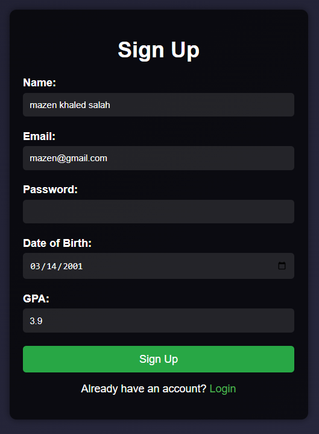
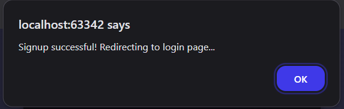
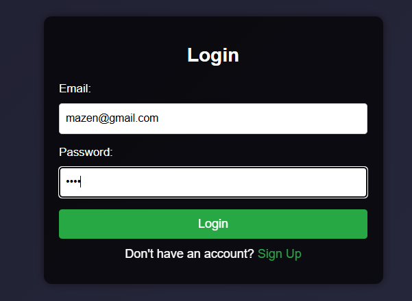
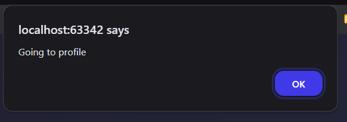
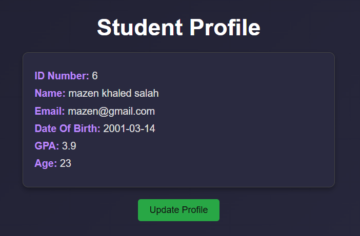
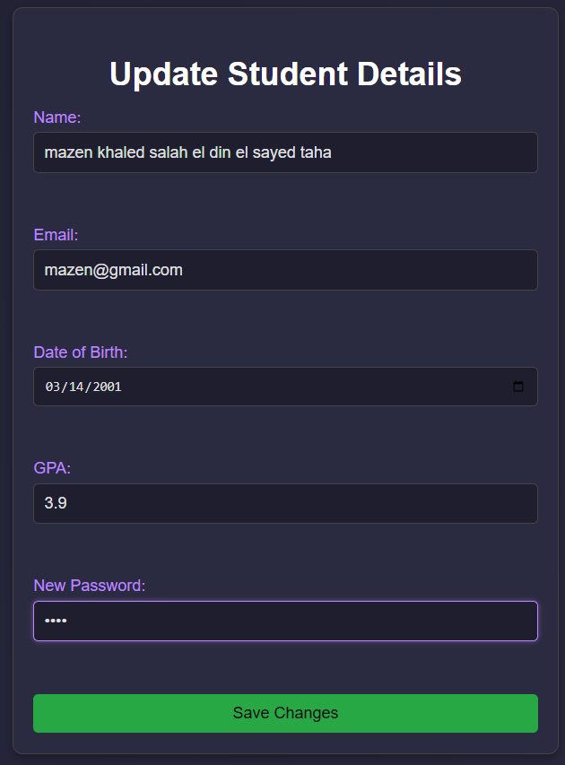
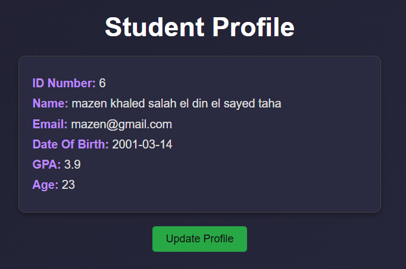

# College Management System

## 📋 Overview
This **College Management System** is a full-stack application developed using **Spring Boot** for the backend and **HTML, CSS, JavaScript** for the frontend. It is designed to handle student information such as registration, profile management, and authentication.

### The system enables administrators and users to:

#### 1. Sign-Up Page
<p align="center">
  
</p>
This page allows new users to create an account.

#### 2. Sign-Up Success
<p align="center">
  
</p>
Confirmation screen showing successful registration.

#### 3. Login Page
<p align="center">
  
</p>
Existing users can log in from this page.

#### 4. Logging In
<p align="center">
  
</p>
Shows the process of logging into the system.

#### 5. Student Profile
<p align="center">
  
</p>
Displays student information in the profile section.

#### 6. Updating Student Data
<p align="center">
  
</p>
Page for updating student data.

#### 7. Updated Student Profile
<p align="center">
  
</p>

## 🚀 Features
### Backend (Spring Boot)
- **CRUD Operations** for managing student data.
- **JPA Repository** integration for seamless database communication.
- **Email Validation** to ensure unique student emails.
- **Exception Handling** for missing or invalid data.
- **CORS Configuration** for secure cross-origin requests.

### Frontend
- User-friendly login and sign-up forms.
- **Signup Page:** Allows new students to register by submitting their name, email, password, date of birth, and GPA. Data is sent to the backend via a POST request.
- Profile display and update functionality.
- Dynamic interaction using JavaScript for form validation and profile updates.

## 🏗️ Project Structure
```
com.example.College_System
│
├── CollegePackage.Student
│   ├── ControllerLayer         # REST controllers
│   ├── DataBaseLayer           # Student entity and database models
│   ├── DatabaseConfig          # Database and CORS configuration
│   ├── ReposatoryLayer         # JPA repository for database operations
│   └── ServiceLayer            # Business logic services
│
├── Frontend
│   ├── HTML_Files              # Login, sign-up, and profile pages
│   ├── CSS_Files               # Styling for pages
│   └── JS_Files                # JavaScript for interactivity
```

## 🔧 Technologies Used
- **Backend:** Java, Spring Boot, JPA, Hibernate
- **Frontend:** HTML, CSS, JavaScript
- **Database:** PostgreSQL Database
- **Build Tool:** Maven

## 🛠️ Installation & Setup
### Prerequisites
- Java JDK 17+
- Maven

### Backend Setup
1. Clone the repository:
   ```bash
   git clone https://github.com/mazen-khaled/College-Backend-System
   ```
2. Navigate to the project directory:
   ```bash
   cd College-Backend-System
   ```
3. Run the application:
   ```bash
   mvn spring-boot:run
   ```

### Frontend Setup
1. Open the HTML files directly in your browser, or use a local server (e.g., **Live Server** extension in VSCode).
2. To access the sign-up page, open `signUp.html` from the HTML files directory.

## 📖 API Endpoints
| Method | Endpoint               | Description                         |
|--------|------------------------|-------------------------------------|
| GET    | `/v1/students`        | Retrieve all students               |
| GET    | `/v1/students/id/{id}`| Get student by ID                   |
| GET    | `/v1/students/email/{email}` | Get student by email         |
| POST   | `/v1/students`        | Add a new student                   |
| PUT    | `/v1/students`        | Update an existing student          |
| DELETE | `/v1/students/{id}`   | Delete student by ID                |

## 🎯 Usage Example
**POST** Add New Student:
```json
{
  "studentName": "Mazen Khaled",
  "studentEmail": "Mazen@gmail.com",
  "studentPassword": "1234",
  "studentDOB": "2001-03-14",
  "studentGPA": 3.5
}
```

**GET** Retrieve Student by ID:
```
GET /v1/students/id/1
```

## 💡 Future Improvements
- Role-based authentication (Admin, Student).
- Enhanced frontend with React or Angular.
- Implement JWT-based authentication.

## 📬 Contact
For questions or feedback:
- Email: [kmazen275@gmail.com](mailto:kmazen275@gmail.com)

Enjoy using the **College Management System**! 🎓